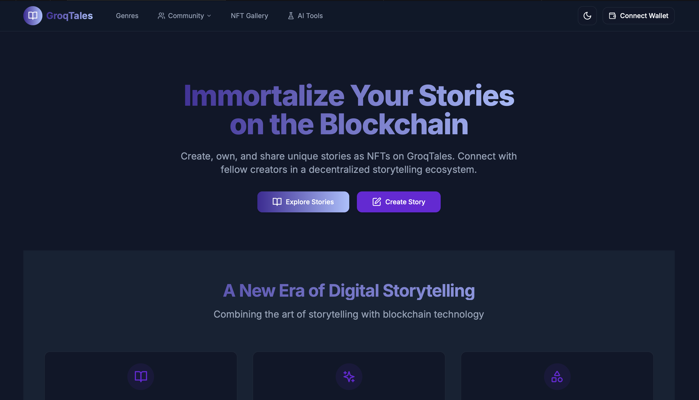
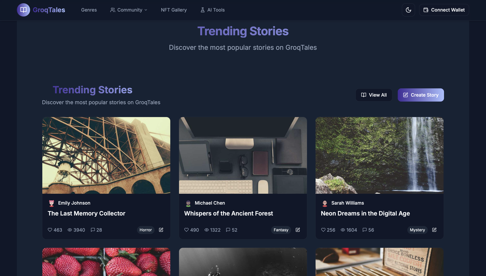
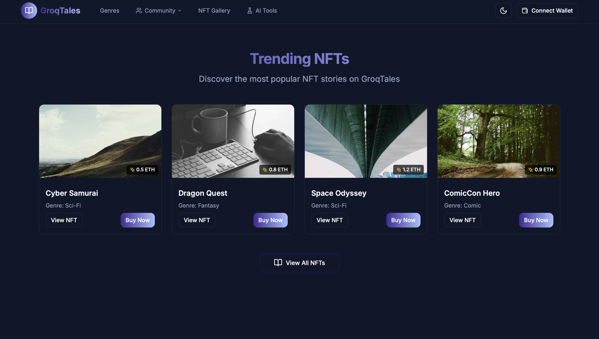
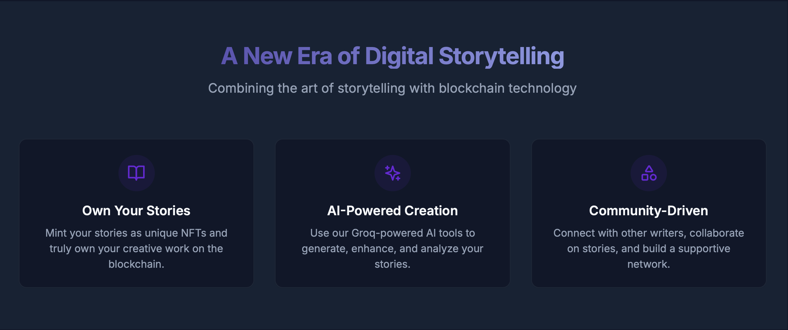
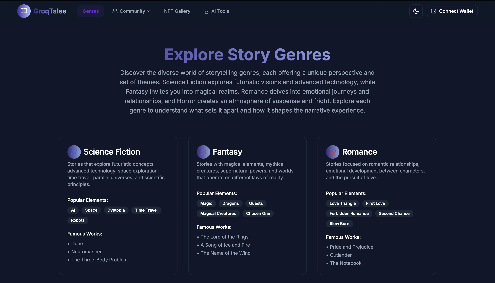

# 🚀 GroqTales

> AI-Powered Story Generation and NFT Minting Platform

---

## 📌 Problem Statement

**Problem Statement 1 – Weave AI Magic with Groq**

---


## 🎯 Objective

GroqTales aims to revolutionize storytelling by leveraging AI to generate unique stories and comics, which can be minted as NFTs on the Monad blockchain. This platform serves writers, artists, and blockchain enthusiasts by providing a creative tool to craft and own digital storytelling assets.

---

## 🧠 Team & Approach

### Team Name: **Indie Hub**

### Team Members

- Mantej Singh Arora [](https://github.com/Drago-03) [](https://www.linkedin.com/in/mantej-singh-arora/)  
- Fatima Kacchi [](https://github.com/Cyber-warrior-01) [](https://www.linkedin.com/in/fatima-kachhi-8985632a3/)  
- Avya Giri [](https://github.com/Webwizzz22) [](https://www.linkedin.com/in/avya-giri/)  

### Your Approach  

- **Why you chose this problem**: We chose this problem to merge the power of AI with blockchain technology, creating a unique platform for storytellers to not only generate creative content but also own and monetize it as NFTs. The intersection of AI and blockchain offers a novel solution to digital content ownership and creativity.
- **Key challenges you addressed**: Integrating Groq AI for high-quality story generation, ensuring seamless NFT minting on the Monad blockchain, and designing an intuitive user interface for story customization and wallet connection were major challenges. We also focused on handling API rate limits and ensuring secure wallet interactions.
- **Any pivots, brainstorms, or breakthroughs during hacking**: Initially, we focused solely on text stories, but during brainstorming, we pivoted to include comic-style stories with panel-by-panel breakdowns. A breakthrough came with implementing streaming responses from Groq API for real-time story generation feedback, enhancing user experience.

---

## 🛠️ Tech Stack

### Core Technologies Used

- **Frontend**: React, Next.js
- **Backend**: Node.js
- **Database**: MongoDB
- **APIs**: Groq API for AI generation, Unsplash API for images
- **Hosting**: Vercel

### Sponsor Technologies Used (if any)

- [✅] **Groq**: *Used for AI-powered story and comic generation*  
- [✅] **Monad**: *Implemented for NFT minting on the blockchain*  
- [ ] **Fluvio**: *Real-time data handling*  
- [ ] **Base**: *AgentKit / OnchainKit / Smart Wallet usage*  
- [ ] **Screenpipe**: *Screen-based analytics or workflows*  
- [ ] **Stellar**: *Payments, identity, or token usage*

---

## ✨ Key Features

- **AI-Generated Stories and Comics**: Leverage Groq AI to create unique text stories and comic-style narratives with detailed prose or panel-by-panel breakdowns.
- **NFT Minting on Monad Blockchain**: Mint your generated stories as NFTs on the Monad blockchain, ensuring ownership and potential monetization of digital content.
- **Customizable Story Parameters**: Tailor your story with selectable genres, character details, plot outlines, settings, themes, and additional instructions for personalized content.
- **Wallet Connection for Publishing and Minting**: Securely connect your wallet to publish stories to the community or mint them as NFTs, with support for Monad network switching.
- **Advanced Story Generation Options**: Adjust creativity levels, choose AI models, and use custom Groq API keys for enhanced control over story generation.
- **Real-Time Story Streaming**: Experience real-time feedback during story generation with streaming responses from the Groq API.
- **Story Preview and Editing**: Preview generated content, copy, download, or edit stories before finalizing or minting.

**Screenshots of GroqTales Features:**

- **Dashboard Overview 1**: A glimpse of the main dashboard interface.  
  
- **Dashboard Overview 2**: Another view of the dashboard with different features highlighted.  
  
- **Dashboard Overview 3**: Additional dashboard perspective showcasing user interactions.  
  
- **Description Input**: Interface for entering story descriptions.  
  
- **Story Generator Tool**: The main tool for generating AI stories.  
  
- **Story and Genre Type Selection**: Options for selecting story types and genres.  
  
- **Generation Window and Advanced Options**: Interface showing story generation and advanced settings.  
  
- **Define Outline for Story**: Tool to define the outline and structure of your story.  
  
- **Genres Selection**: Interface for choosing genres for story customization.  
  
- **Community Page**: A view of the community interaction page.  
  

---

## 📽️ Demo & Deliverables

- **[GroqTales](https://groq-tales.vercel.app)**

---

## ✅ Tasks & Bonus Checklist

- [✅] **All members of the team completed the mandatory task - Followed at least 2 of our social channels and filled the form** (Details in Participant Manual)  
- [✅] **All members of the team completed Bonus Task 1 - Sharing of Badges and filled the form (2 points)** (Details in Participant Manual)  
- [✅] **All members of the team completed Bonus Task 2 - Signing up for Sprint.dev and filled the form (3 points)** (Details in Participant Manual)  

---

## 🧪 How to Run the Project

### Requirements

- **Node.js**: Version 16.x or higher for running the Next.js application.
- **API Keys**: Groq API key for AI story generation (optional, but recommended for custom usage). Unsplash API key for image placeholders (optional).
- **Wallet**: A crypto wallet (like MetaMask) installed and configured to connect to the Monad blockchain for NFT minting and story publishing.
- **.env file setup**: Required for storing API keys and environment variables. Use the provided `.env.example` as a template.

### Local Setup

```bash
# Clone the repo
git clone https://github.com/mantej-arora/GroqTales

# Navigate to the project directory
cd GroqTales

# Install dependencies
npm install

# Create a .env.local file based on the .env.example template
cp .env.example .env.local

# Edit .env.local to add your API keys
# For example:
# NEXT_PUBLIC_GROQ_API_KEY=your_groq_api_key_here
# NEXT_PUBLIC_UNSPLASH_API_KEY=your_unsplash_api_key_here
# NEXT_PUBLIC_MONAD_NETWORK_ID=your_monad_network_id_here

# Start the development server
npm run dev
```

**Additional Setup Notes**:

- **Frontend/Backend Split**: The project uses Next.js for both frontend and backend (API routes). Ensure API routes in `pages/api/` are correctly configured if extending functionality.
- **Wallet Connection**: To test NFT minting or story publishing, connect your wallet (e.g., MetaMask) and ensure it's set to the Monad network. The app will prompt for network switching if needed.
- **Environment Variables**: All sensitive keys must be stored in `.env.local`. Do not commit this file to version control.

---

## 🧬 Future Scope

- **📈 More AI Model Integrations**: Incorporate additional AI models for diverse storytelling styles and capabilities, such as OpenAI's latest models or specialized creative writing AIs.
- **🛡️ Enhanced Security for NFT Ownership**: Implement advanced encryption and multi-factor authentication for wallet interactions to ensure maximum security of digital assets.
- **🌐 Multilingual Story Generation**: Expand GroqTales to support story generation in multiple languages, making it accessible to a global audience.
- **🎨 AI-Generated Visuals for Comics**: Integrate image generation models (e.g., DALL-E, Stable Diffusion) to automatically create visual panels for comic stories alongside text.
- **🤝 Community Features and Marketplace**: Build a community hub for users to share, rate, and trade their NFT stories, fostering a vibrant ecosystem of creators and collectors.
- **📱 Mobile App Development**: Create a mobile version of GroqTales for on-the-go story creation and NFT management.

---

## 📎 Resources / Credits

- **APIs or Datasets Used**:
  - **Groq API**: For powering AI-driven story and comic generation with high-speed inference.
  - **Unsplash API**: For fetching relevant placeholder images based on story genres and themes.
- **Open Source Libraries or Tools Referenced**:
  - **React & Next.js**: For building a dynamic and performant frontend and backend.
  - **shadcn/ui**: For beautifully crafted UI components used throughout the application.
  - **Framer Motion**: For smooth animations enhancing user experience.
  - **Lucide React**: For providing a rich set of icons used in the interface.
  - **Monad SDK**: For seamless integration with the Monad blockchain for NFT minting.
- **Acknowledgements**:
  - Thanks to the Groq team for providing cutting-edge AI inference capabilities.
  - Gratitude to the Monad blockchain community for their support in NFT integration.
  - Special mention to the hackathon organizers for the opportunity to build and showcase GroqTales.

---

## 🏁 Final Words

Our journey building GroqTales during this hackathon has been exhilarating. We faced challenges in integrating AI with blockchain technology, but the learning curve was incredibly rewarding as we mastered new tools and frameworks. The breakthrough of real-time story streaming and the pivot to include comic-style narratives were fun and pivotal moments for our team. We're proud to present a platform that empowers creators to not only craft unique stories but also own them as digital assets. A huge shout-out to our team for the sleepless nights and endless creativity, and to the mentors and peers who provided invaluable feedback. GroqTales is just the beginning of our vision to redefine digital storytelling! Created by [Indie Hub](https://indie-hub-landing-page-git-main-dragos-projects-f5e4e2da.vercel.app)

---
