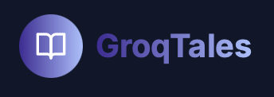

# 🚀 GroqTales

> AI-Powered Story Generation and NFT Minting Platform

---

## 📌 Problem Statement

Select the problem statement number and title from the official list given in Participant Manual.

**Example:**  
**Problem Statement 7 – Transform the Future of Rural Commerce**

---

## 🎯 Objective

GroqTales aims to revolutionize storytelling by leveraging AI to generate unique stories and comics, which can be minted as NFTs on the Monad blockchain. This platform serves writers, artists, and blockchain enthusiasts by providing a creative tool to craft and own digital storytelling assets.

---

## 🧠 Team & Approach

### Team Name:  
`Your team name here`

### Team Members:  
- Name 1 (GitHub / LinkedIn / Role)  
- Name 2  
- Name 3  
*(Add links if you want)*

### Your Approach:  
- Why you chose this problem  
- Key challenges you addressed  
- Any pivots, brainstorms, or breakthroughs during hacking  

---

## 🛠️ Tech Stack

### Core Technologies Used:
- Frontend: React, Next.js
- Backend: Node.js
- Database: MongoDB
- APIs: Groq API for AI generation, Unsplash API for images
- Hosting: Vercel

### Sponsor Technologies Used (if any):
- [✅] **Groq:** _Used for AI-powered story and comic generation_  
- [✅] **Monad:** _Implemented for NFT minting on the blockchain_  
- [ ] **Fluvio:** _Real-time data handling_  
- [ ] **Base:** _AgentKit / OnchainKit / Smart Wallet usage_  
- [ ] **Screenpipe:** _Screen-based analytics or workflows_  
- [ ] **Stellar:** _Payments, identity, or token usage_
*(Mark with ✅ if completed)*
---

## ✨ Key Features

Highlight the most important features of your project:

- ✅ AI-Generated Stories and Comics  
- ✅ NFT Minting on Monad Blockchain  
- ✅ Customizable Story Parameters (Genre, Characters, Plot, etc.)  
- ✅ Wallet Connection for Publishing and Minting  

Add images, GIFs, or screenshots if helpful!

---

## 📽️ Demo & Deliverables

- **Demo Video Link:** [Paste YouTube or Loom link here]  
- **Pitch Deck / PPT Link:** [Paste Google Slides / PDF link here]  

---

## ✅ Tasks & Bonus Checklist

- [ ] **All members of the team completed the mandatory task - Followed at least 2 of our social channels and filled the form** (Details in Participant Manual)  
- [ ] **All members of the team completed Bonus Task 1 - Sharing of Badges and filled the form (2 points)**  (Details in Participant Manual)
- [ ] **All members of the team completed Bonus Task 2 - Signing up for Sprint.dev and filled the form (3 points)**  (Details in Participant Manual)

*(Mark with ✅ if completed)*

---

## 🧪 How to Run the Project

### Requirements:
- Node.js
- API Keys (Groq API for AI generation, optional)
- .env file setup (if needed)

### Local Setup:
```bash
# Clone the repo
git clone https://github.com/your-team/project-name

# Install dependencies
cd project-name
npm install

# Start development server
npm run dev
```

Provide any backend/frontend split or environment setup notes here.

---

## 🧬 Future Scope

List improvements, extensions, or follow-up features:

- 📈 More AI model integrations  
- 🛡️ Enhanced security for NFT ownership  
- 🌐 Multilingual story generation and broader accessibility  

---

## 📎 Resources / Credits

- APIs or datasets used: Groq API, Unsplash API  
- Open source libraries or tools referenced: React, Next.js, Monad SDK  
- Acknowledgements  

---

## 🏁 Final Words

Share your hackathon journey — challenges, learnings, fun moments, or shout-outs!

---